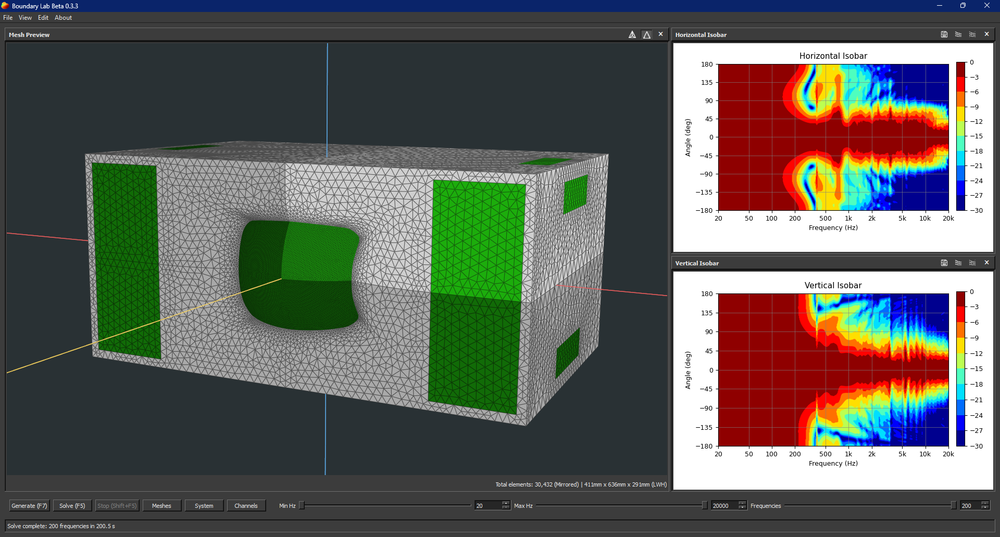

# Boundary Lab



Boundary Lab is a GUI-based multiphysics acoustic simulation tool for loudspeaker design. It generates or imports loudspeaker meshes, infers exterior BEM or coupled FEM-BEM-LEM solving from the configured physical system, and presents SPL, directivity, radiation impedance, spinorama-style curves, and 3D balloon plots in the desktop application. Ath is the bundled geometry-generator provider.

### [Follow the official development thread on DIYAudio](https://www.diyaudio.com/community/threads/boundary-lab.440847/)

## Features

- Waveguide design editor with one-click geometry generation through the bundled [Ath4](https://at-horns.eu/) generator
- 3D mesh viewport for generated geometry and imported `.msh` files
- Physical-system editor for exterior BEM and coupled FEM-BEM-LEM models
- Prescribed-velocity and linear electrodynamic transducer components
- Channel controls for level, polarity, delay, and HPF/LPF crossover shaping
- Live horizontal/vertical directivity, on-axis response, spinorama, and radiation-impedance plots
- Plot-image, polar-data, on-axis channel-data, and balloon-data export
- 3D balloon viewer built directly from Fibonacci-sphere solve samples
- Project save/load with readable, backward-compatible `.blab.json` files

## Base Requirements

- Windows 10/11 64-bit / Linux / MacOS
- Python 3.11 or newer
- Wine is required if using Ath to generate meshes


While not required, if modeling in Autodesk Fusion, the [Fusion2Msh](https://github.com/JWSound/fusiontomsh) add-in is strongly recommended for quick imports of mesh files into Boundary Lab.

## Solver Requirements

The application offers three local production backends: BEAT Engine CUDA, BEAT Engine CPU, and Bempp OpenCL CPU. It can also submit exterior BEM jobs to a Boundary Lab server. The ROCm selector is visible for forward compatibility, but that backend is not yet implemented. Performance depends strongly on the mesh and hardware; CUDA is generally the fastest choice on a supported NVIDIA GPU. Coupled physical systems require the local BEAT Engine CPU or CUDA backend.

### BEAT Engine CUDA GPU Solver Requirements

- NVIDIA Maxwell-generation or newer GPU
- Latest NVIDIA Studio/Game Ready driver recommended
- [Julia](https://julialang.org/downloads/manual-downloads/) installed and available on `PATH`

To prepare the Julia environment, from the repository root run:

```bash
julia --project=src/blab/solvers/julia_cuda -e "using Pkg; Pkg.instantiate()"
```

GPU solving VRAM requirements scale quadratically with mesh element count. Below are estimated VRAM requirements for various element counts:

| Total Elements | Estimated VRAM |
|---:|---:|
| 1,000 | ~50-100 MB |
| 2,000 | ~200-300 MB |
| 3,000 | ~400-600 MB |
| 5,000 | ~1.0-1.5 GB |
| 7,000 | ~2.0-3.0 GB |
| 10,000 | ~4-6 GB |
| 15,000 | ~8-12 GB |
| 20,000 | ~14-20 GB |

### BEAT Engine CPU Solver Requirements

- Intel, AMD, or ARM CPU
- [Julia](https://julialang.org/downloads/manual-downloads/) installed and available on `PATH`

To prepare the Julia environment, from the repository root run:

```bash
julia --project=src/blab/solvers/julia_local -e "using Pkg; Pkg.instantiate()"
```

### Bempp CPU Solver Requirements

- Intel or AMD CPU
- An OpenCL runtime

The [Intel CPU OpenCL runtime](https://www.intel.com/content/www/us/en/developer/articles/technical/intel-cpu-runtime-for-opencl-applications-with-sycl-support.html) is a practical option even on many non-Intel systems.

## Application Installation

### Windows batch-file setup

Windows 10/11 users can double-click `01_install_update_boundary-lab.bat` from
the repository folder. The guided installer creates the Python environment,
installs or repairs Boundary Lab, and optionally prepares the Julia BEAT Engine
CPU and NVIDIA CUDA solvers. If it installs a system prerequisite, close the
window and run the script again as instructed.

Run the same script later to optionally pull the latest `main` branch and update
the installation. Start the application with `02_start_boundary_lab.bat`. To
change a saved NVIDIA GPU selection, run the launcher from Command Prompt with:

```bat
02_start_boundary_lab.bat /choose
```

### Manual setup

From the repository root run:

```bash
python -m pip install -e ".[gui]"
```

## Run The GUI

```bash
blab gui
```

On startup, Boundary Lab updates `ath/ath.cfg` so Ath writes its raw generated files into:

```text
runs/ath_output
```


## Boundary Lab Server

Boundary Lab can also run a local or LAN-accessible job server that accepts solve
jobs and streams per-frequency results back as NDJSON events:

```bash
blab server --host 127.0.0.1 --port 8765 --solver bempp_cpu
blab server --host 127.0.0.1 --port 8765 --solver beat_cpu --julia-threads auto
blab server --host 127.0.0.1 --port 8765 --solver beat_cuda
```

Supported server-side solver IDs are `bempp_cpu` for Bempp OpenCL CPU, `beat_cpu`,
`beat_cuda`, and `beat_rocm`. ROCm is accepted as a server selector but the ROCm
BEAT Engine implementation is still a placeholder and will report not implemented
until that engine path is completed. For BEAT Engine solvers, use
`--julia-executable` and `--julia-threads` to point the server at the intended
Julia installation and thread count.

To use it from the GUI application, open `Edit > Preferences`, set `BEM Solver` to
`Server`, and set `Solve Server URL` to the server address. Use `Check Server` to
query `/health`; the app uses the advertised capabilities, such as mesh
symmetry support for feature availability. For another machine on the LAN, bind
the server to that machine's LAN address or `0.0.0.0` and use
`http://<server-ip>:8765` in the client. The GUI uploads the solver mesh files
with each server job, so the server does not need access to the client's local
paths.

Server authentication is optional. Set `BLAB_AUTH_TOKEN` on an
internet-reachable server and configure the same token in Preferences; Boundary
Lab retains it for the current application session and sends it as an HTTPS
bearer token. Keep a safe copy because it is not stored after Boundary Lab
exits. Unauthenticated HTTP remains available for localhost and trusted private
networks.

For authenticated Docker and Runpod deployment with the BEAT Engine CUDA solver, see
[Docker](docs/Docker.md).

## Documentation

- [User Guide](docs/User%20Guide.md)
- [Physical System Model](docs/Physical%20System%20Model.md)
- [Coupled Solver](docs/Coupled%20Solver.md)
- [Boundary Lab Server](docs/Boundary%20Lab%20Server.md)
- [CUDA Server Docker Image](docs/Docker.md)
- [Model Assumptions](docs/Model%20Assumptions.md)
- [Inputs and Outputs](docs/Inputs%20and%20Outputs.md)
- [Advanced CLI workflow](docs/advanced/cli-workflow.md)
- [BEAT Engine Core](docs/advanced/beat-engine-core.md)
- [BEAT Engine CPU](docs/advanced/beat-engine-CPU.md)
- [BEAT Engine CUDA](docs/advanced/beat-engine-CUDA.md)
- [Forward Beam Shape plot](docs/advanced/forward-beam-shape.md)
