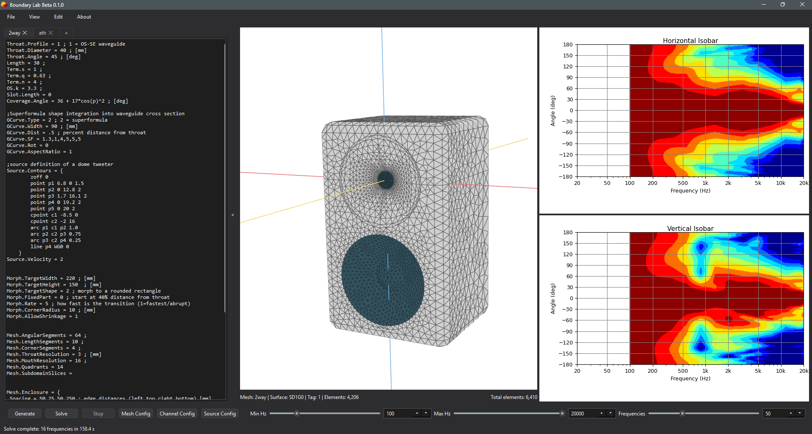
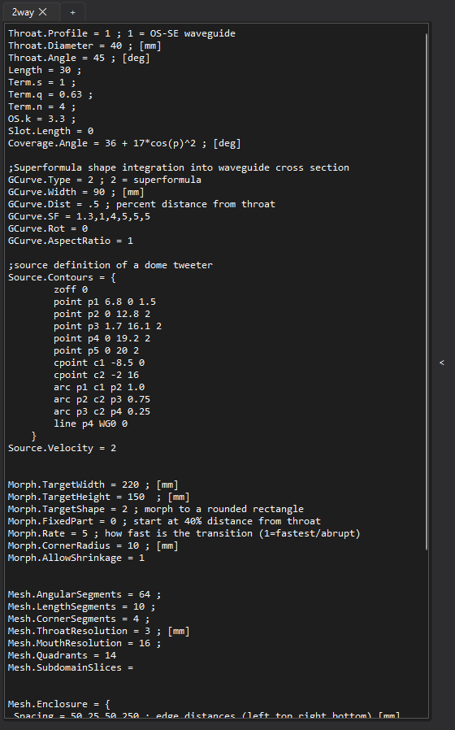
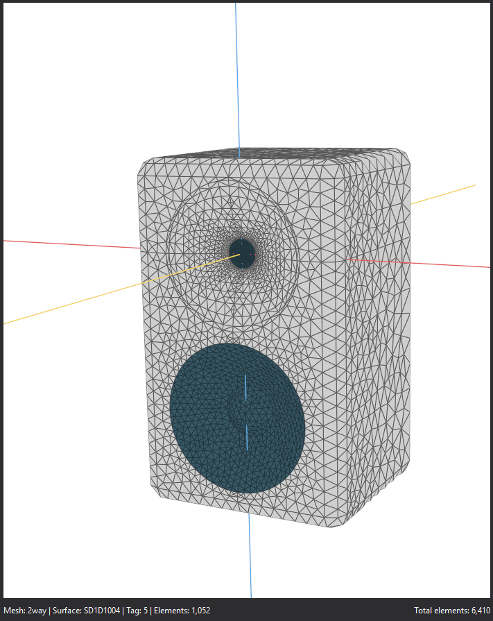
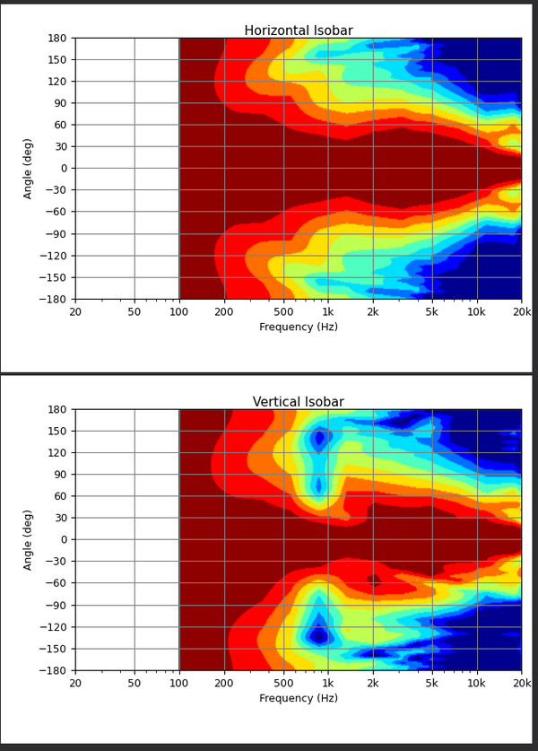
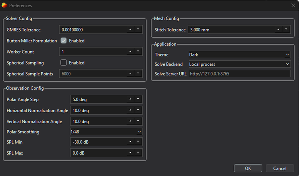
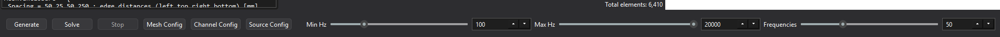
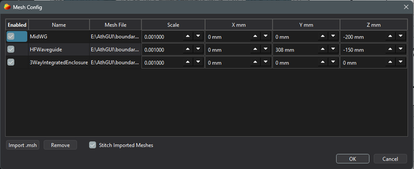
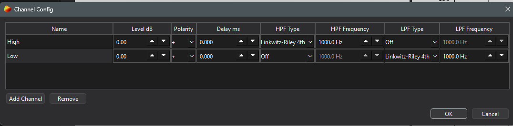
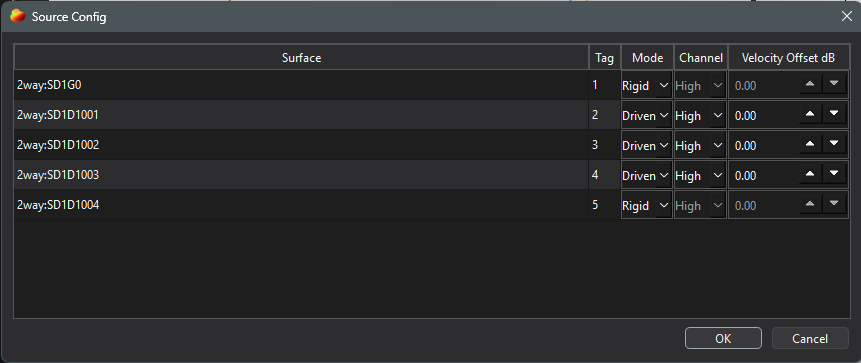
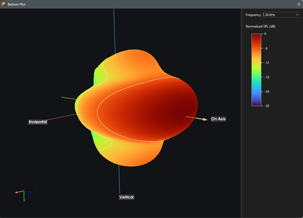

# Main Window

The main window is divided into 3 panes:

- Ath script editor on the left
- 3D viewport in the middle
- Output plots on the right



Each pane can be resized as needed for various workflows and screen sizes.

The command strip along the bottom of the window contains geometry generation, solve controls, mesh/source/channel configuration, and frequency range settings.

## Ath Script Editor
The Ath script editor on the left pane contains a text editor for defining Ath shapes. Existing Ath .cfg files can be imported/exported into this editor using `File` > `Import/Export .cfg`.



The pane can be collapsed or expanded using the chevron button the right of it. 

Ath scripts can be added, removed, and renamed using the tab controls at the top of the editor pane. To rename a script, double click its tab. Multi-script workflows can be useful for complex multiway designs (see /examples/MultiAth+Mesh_3WayIntegrated), or worflows where you might be comparing outputs on the same script with different values by copy/pasting it into multiple script tabs and enabling/disabling them in the `Mesh Config` window.

## 3D Viewport


The 3d viewport contains all active mesh files in the project. Surfaces are color coded as blue for driven and grey for rigid. Hovering over the meshes displays the mesh name, surface name, surface index, and number of elements for that surface group. The bottom right of the 3D viewport displays the total element count for all active meshes.



The viewport displays a yellow line for the on-axis vector, a blue line for the vertical axis, and a red line for the horizontal axis emanating from the origin. All directivity calculations are performed relative to the origin, with the on-axis direction facing along the +z axis. Use the mesh config window to move the active mesh files in 3D space so that the appropriate location for the origin is used.

## Plot Viewer
Displays the currently selected plots as configured from the `view` menu. Results are streamed in realtime to the plots as solves are ran.



## Menu Bar
### File Menu

- `New Project`: clears the editor, mesh setup, source setup, preview, and solved data.
- `Save Project`: saves the current project to the active `.blab.json` file.
- `Save Project As`: chooses a new `.blab.json` path.
- `Load Project`: loads editor text, mesh config, and source config.
- `Import .cfg`: imports only Ath config text into the editor.
- `Export .cfg`: exports only the editor contents.
- `Export Plot`: exports generated plot panels as PNG files.
- `Export Polar Data`: exports solved horizontal and vertical polar text files. Channel-basis solves export frequency, normalized SPL, and relative phase.

Project files do not store solved results or global preferences.

### View Menu

The View menu enables/disables various plots that are displayed in the plot viewer pane of the main window. It also opens the balloon plot viewer in a new window. The balloon plot viewer can only be opened once there is a completed or stopped solve.

## Edit/Preferences Menu

The preferences menu contains various application-level settings for Boundary Lab. The default values for these settings can be used for most projects.



### Solver Config
- `GMRES Tolerance`: sets the threshold for how accurate the BEM solution needs to be at each frequency being solved. Lower values (moving the 1 to the right) increase solve times but may produce more accurate results. High values (moving the 1 to the left) decrease solve accuracy but also decrease solve times.
- `Burton Miller Formulation`: enable/disable the Burton-Miller formulation to prevent the exterior Helmholtz boundary integral equation from becoming unreliable at certain frequencies due to fictitious cavity resonances. Not always required but turning this feature on can reduce polar irregularities with certain meshes- especially ones having enclosed volumes. Turning this feature off can typically decrease solve times by 30-40%.
- `Worker Count`: Experimental - allocate CPU worker threads to the solver. The default value is 1, but changing this may either increase or decrease solve times depending on your hardware and mesh complexity.
- `Spherical Sampling`: Enable or disable spherical sampling needed to generate balloon plots. This feature generates a 2 meter diameter grid of sampling points around the origin according to a Fibonacci spherical sampling sequence to approximate equal point spacing. Enabling/disabling this feature typically has a minimal (<3%) impact on performance.
- `Spherical Sample Points`: The number of points generated for the spherical balloon plot sampler. More points produce more detailed balloon plots, but slightly increase run times. The default value of 6000 produces an angular resolution of 2.5 degrees, which is sufficient for most loudspeaker BEM analysis.

### Observation Config
- `Polar Angle Step`: The number of degrees between each observation point that generates the horizontal/vertical polar plots. A step angle of 5 degrees evaluates 72 points across a 360 degree arc on each axis. If you intend to view the Spinorama-style plot, ensure this value is set to max 10 degrees. Changing this value has extremely little impact on solve times (<1%).
- `Normalization Angles`: Set the polar normalization angles used to offset SPL values in polar directivity plots and balloon plots.
- `Spin Horizontal/Vertical Ref Angle`: Set the reference axis angles used by the spinorama-style reference-axis and listening-window curves. These angles do not renormalize the polar data used for early reflections or sound power.
- `Polar Smoothing`: Set the smoothing scale for polar directivity plots, spinorama-style plots, and balloon plots.
- `SPL Min`: Set the minimum clipped SPL value for generating polar directivity & balloon plots. Simulated SPL values below this are clipped to this value as the floor.
- `SPL Max`: Set the maximum clipped SPL values for generating polar directivity & balloon plots. Simulated SPL values above this are clipped to this value as a ceiling.

### Mesh Config
- `Stitch Tolerance`: Set the search distance for nearby open edges when combining multiple mesh files in the same project.
- `Symmetry`: Enable half or quarter symmetry that mirrors all active meshes along the X or X/Y axes for significantly faster solving. Currently only supported with the Julia CUDA solver backend. Mirrored mesh elements are shaded darker in the 3d viewport.

### Application
- `Theme`: Boundary Lab visual UI theme.
- `Solve Backend`: Set the solver backend to either use a built-in application solver, or a server-based backend.
    1. **Server** - Use whatever solver is configured on the remote server via the HTTP streaming API.
    2. **Julia CUDA GPU** - Use the Julia-based GPU solver. Requires Julia and an NVIDIA GPU with a working CUDA-capable driver.
    3. **Bempp OpenCL CPU** - Use the bempp-cl OpenCL solver backend. Requires an OpenCL runtime to be installed.

- `Solve Server URL`: The address and port of the server if using a server-based solver backend. 

## Command Strip
The command strip is located along the bottom of the main window and includes controls to generate Ath meshes, run solves, and configure the project parameters.



### Generate

Click `Generate` to run `ath/ath.exe` against the editor text. Boundary Lab writes the temporary `.cfg`, lets Ath generate geometry, cleans the generated mesh, and loads it into the preview.

Ath outputs are written under:

```text
runs/ath_output
```

### Solve
Initiates the boundary element method (BEM) solver against the current project as it is represented in the 3d viewport and configurations.

Note - the first time solve after opening Boundary Lab will typically take longer as the tool loads backend libraries and initializes OpenCL caches. Subsequent solves utilize the OpenCL warmed caches for faster runtimes.

### Solve/Stop
Click `Solve` to start the BEM sweep. Enabled plots update in realtime as each frequency completes. Click `Stop` to stop after the current in-flight frequency finishes; completed frequencies remain available for plotting/export.

### Mesh Config
`Mesh Config` lists the generated Ath meshes and any imported `.msh` files.



If you've generated any Ath meshes, they will be visible as the top rows in the mesh config window.

Imported `.msh` rows can be enabled/disabled, renamed, removed, scaled, and translated.

When imported meshes are enabled, they are included in the preview and solve. If mesh stitching is enabled in Mesh Config, Boundary Lab can stitch the active generated/imported meshes before solving. The stitching toggle is saved with the project.

### Channel Config
`Channel Config` is used to define the channels present in the loudspeaker. It is only used when solving multiway loudspeaker projects where the effects of source-source interference patterns are important. Changes to the channel config affect all sources allocated to that channel.



- `Name`: Double click to define the channel name
- `Level dB`: apply a level offset to this channel
- `Polarity`: sets the channel polarity
- `Delay ms`: sets the delay for this channel in milliseconds
- `HPF/LPF Type`: Sets acoustic highpass/lowpass filters for this channel. Reference the Model Assumptions help article for more information about how Boundary Lab applies crossover filters
- `HPF/LPF Frequency`: Set the frequency of the highpass/lowpass filters

### Source Config

`Source Config` lists mesh surface groups discovered from the active meshes. Use it to mark driven radiator surfaces and set their assigned channel and gain offset.



Generally, the gain offset feature should be used to define complex radiating sources for more accurate BEM modelling. For example, splitting a dome tweeter into 3 surface groups (dome, inner surround, outer surround), allows you to taper off the drive level towards the surround edge. Load the /examples/Ath_2WayBookshelf/ example to see how this can be configured.

Only driven surfaces are excited during the BEM solve. All other surfaces are treated as rigid boundaries. Recall that the 3d viewport displays surface group names when you hover the mouse over the mesh preview.

### Frequency Controls
The frequency controls set the minimum, maximum, and number of frequencies that will be solved when clicking "Solved". The solver automatically uses logarithmic spacing according to the min/max/number.

## Balloon Plot

After a solve with spherical sampling enabled, open:

View > Balloon Plot



The viewer comprises:

- rotatable/zoomable 3D directivity balloon
- frequency picker
- SPL color legend
- 6 dB contour lines drawn on the surface of the balloon
- horizontal, vertical, and on-axis guide lines
- rotatable polar protractor with 30 degree angle spokes and 6 dB rings
- radar directivity plot for the current frequency and protractor angle
- isobar slice rendering for the current polar protractor angle

The balloon viewer uses the frequencies that completed before the solve ended.

Use `File > Export Balloon Data` in the balloon plot window to export a fixed-topology balloon dataset for external visualization tools. The export folder contains metadata, shared surface topology, normalized SPL values, normalized radius values, and per-frequency XYZ positions for the balloon surface only. It does not include contour lines, guide axes, protractor geometry, or radar/isobar plots.
