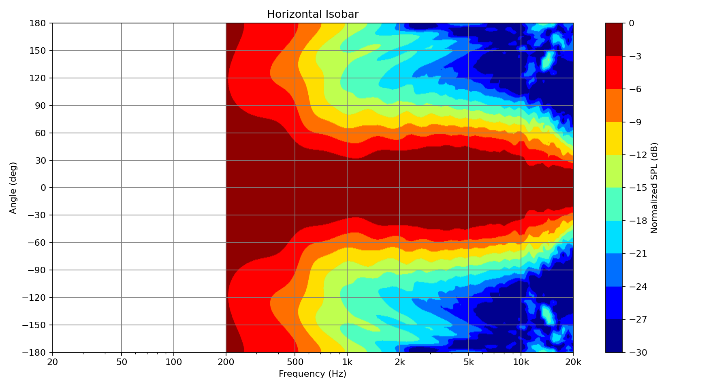
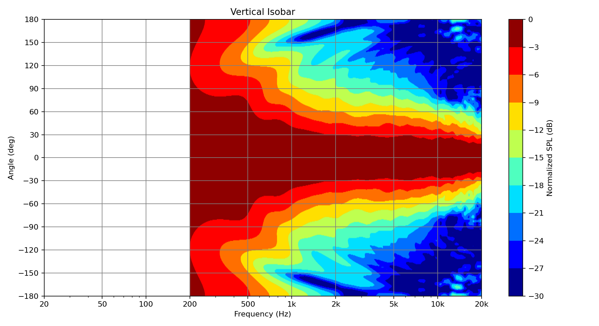
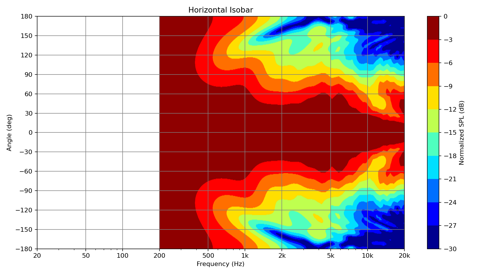
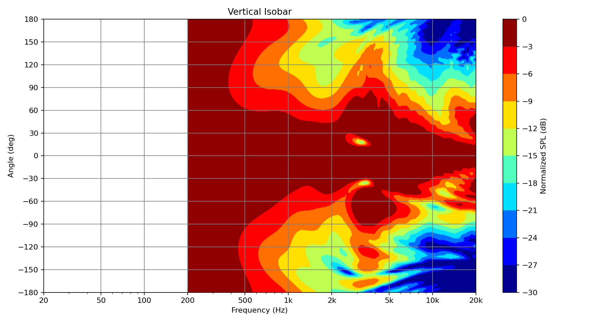

# Running the Examples

The `docs/examples` directory contains complete loudspeaker BEM example cases with meshes, saved solver output, and generated directivity plots.

Run the commands below from the repository root after installing the package in editable mode:

```bash
pip install -e .
```

The full `blab solve` step can take a while because it runs a BEM solve at every frequency point. If you only want to inspect the plotting workflow, use the included `pressure_data_raw.npz` files and start at `blab prepare`.

## Single Radiator Waveguide

Path:

```text
docs/examples/singleradiatorwaveguide
```

This example uses one waveguide mesh and the default single-radiator solver path. The driven surface uses the default `tag_throat = 2`, and the mesh is scaled from millimeters to meters by the default solver scale factor.

### Quick Plot From Included Solver Output

```bash
cd docs/examples/singleradiatorwaveguide
blab prepare pressure_data_raw.npz pressure_data_formatted.npz
blab plot pressure_data_formatted.npz --output-dir .
```

This regenerates:

- `horizontal_isobar.png`
- `vertical_isobar.png`
- `acoustic_impedance.png`

Preview:






### Full Recompute

```bash
cd docs/examples/singleradiatorwaveguide
blab clean waveguide.msh waveguide_clean.msh --merge-tol 1e-9
blab solve waveguide_clean.msh --output-npz pressure_data_raw.npz
blab prepare pressure_data_raw.npz pressure_data_formatted.npz
blab plot pressure_data_formatted.npz --output-dir .
```

Use solve overrides when you want a faster exploratory run:

```bash
blab solve waveguide_clean.msh --output-npz pressure_data_raw.npz --freq-min 200 --freq-max 20000 --freq-count 24 --workers 4
```

## Two-Way Bookshelf

Path:

```text
docs/examples/2waybookshelf
```

This example uses `2wayconfig.toml` to prescribe three radiating surface groups on a two-way loudspeaker mesh:

- `HFDome`, high-passed at 2 kHz
- `HFSurround`, high-passed at 2 kHz and driven 6 dB lower
- `LF`, low-passed at 2 kHz

The config file also sets `scale_factor = 0.001`, so the mesh is interpreted as millimeters and converted to meters for the solve.

### Quick Plot From Included Solver Output

```bash
cd docs/examples/2waybookshelf
blab prepare pressure_data_raw.npz pressure_data_formatted.npz
blab plot pressure_data_formatted.npz --output-dir .
```

This regenerates:

- `horizontal_isobar.png`
- `vertical_isobar.png`
- `acoustic_impedance.png`

Preview:





### Full Recompute

```bash
cd docs/examples/2waybookshelf
blab solve --config 2wayconfig.toml --output-npz pressure_data_raw.npz
blab prepare pressure_data_raw.npz pressure_data_formatted.npz
blab plot pressure_data_formatted.npz --output-dir .
```

Use solve overrides when you want a faster exploratory run:

```bash
blab solve --config 2wayconfig.toml --output-npz pressure_data_raw.npz --freq-min 200 --freq-max 20000 --freq-count 24 --workers 4
```

The TOML path resolver treats mesh paths as relative to the config file, so `file = "2wayexample.msh"` works even when the config is launched from another working directory.

## Running From The Repository Root

If you prefer not to `cd` into an example folder, pass explicit paths:

```bash
blab solve --config docs/examples/2waybookshelf/2wayconfig.toml --output-npz docs/examples/2waybookshelf/pressure_data_raw.npz
blab prepare docs/examples/2waybookshelf/pressure_data_raw.npz docs/examples/2waybookshelf/pressure_data_formatted.npz
blab plot docs/examples/2waybookshelf/pressure_data_formatted.npz --output-dir docs/examples/2waybookshelf
```

The same pattern works for `docs/examples/singleradiatorwaveguide`; just provide the mesh path to `blab solve` instead of `--config`.

## Output Files

Each completed example run writes:

- `pressure_data_raw.npz`: raw solver output containing polar response and impedance arrays
- `pressure_data_formatted.npz`: plot-ready arrays after clipping, interpolation, normalization, and smoothing
- `horizontal_isobar.png`: normalized horizontal directivity map
- `vertical_isobar.png`: normalized vertical directivity map
- `acoustic_impedance.png`: real and imaginary acoustic impedance by radiator

For details on multi-radiator TOML options, see [solver-configuration.md](solver-configuration.md).

